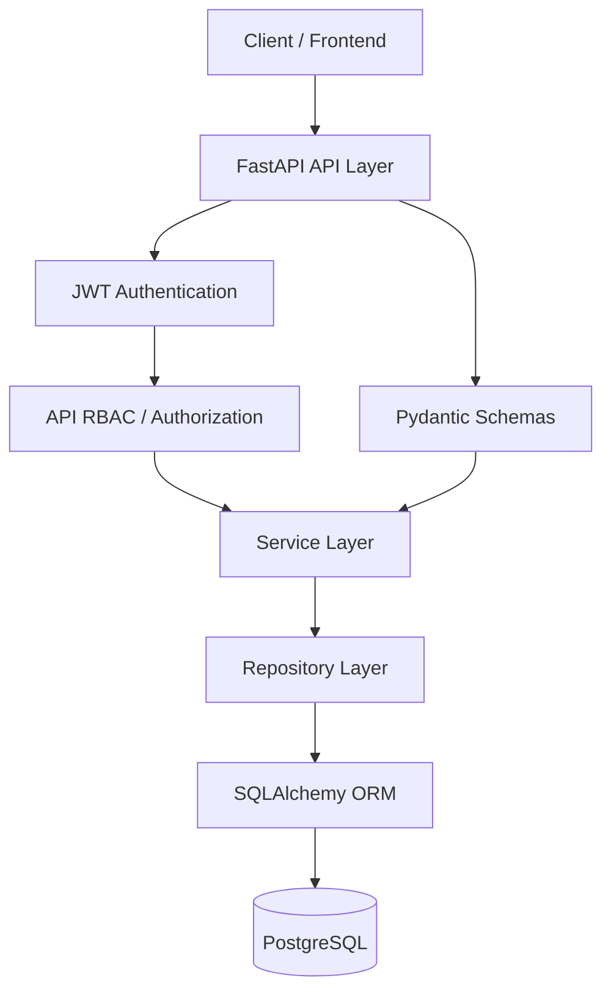
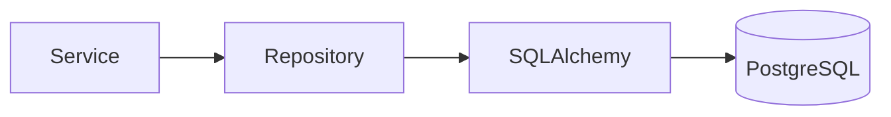
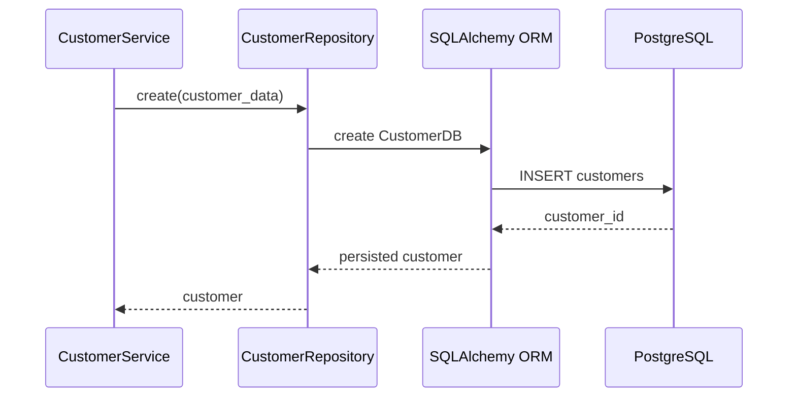
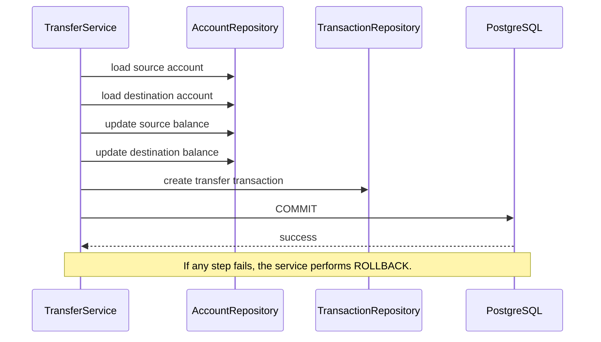

# montcrest-bank-system
A modular banking backend project built in Python with an object-oriented domain model, PostgreSQL persistence, SQLAlchemy ORM, repositories, service-layer business logic, role-based access control, authentication/session concepts, and transaction-safe money movement.

> **Current project state:** The core banking/domain, PostgreSQL persistence, repository layer, service-to-repository refactor, and database transaction/rollback handling are implemented and manually integration-tested. The FastAPI/API layer, Pydantic API schemas, JWT, API-level RBAC, Alembic, automated pytest suite, Docker, and deployment are the next architectural layers.

---

## 1. Project Goal

Montcrest Bank is designed as an interview-grade backend project that demonstrates how a banking domain can be modeled and then evolved into a layered backend application.

The project focuses on **depth rather than breadth**. The business scope is intentionally frozen around the banking capabilities already implemented instead of continuously adding features such as cards, loans, ATMs, or fraud engines.

The goal is to demonstrate:

- Strong Python OOP and domain modeling.
- Separation of business logic from persistence logic.
- PostgreSQL data persistence through SQLAlchemy.
- Repository and service layers.
- Authentication, sessions, roles, permissions, and RBAC concepts.
- Transaction-safe operations such as account-to-account transfers.
- A clear path toward a FastAPI backend.

---

## 2. Current Capabilities

### Customer management

- Customer creation and retrieval.
- Customer status.
- Customer profile information.
- Customer-to-account relationship.

### KYC

- KYC profile modeling.
- KYC verification workflow in the domain layer.

### Accounts

- Savings accounts.
- Current accounts.
- Fixed-deposit accounts.
- Account status.
- Balance management.
- Customer-to-account relationship.

### Transactions

- Deposit transactions.
- Withdrawal transactions.
- Transfer transactions.
- Transaction identifiers.
- Transaction timestamps.
- Transaction status.
- Account transaction history.

### Beneficiaries

- Beneficiary creation.
- Activation/deactivation concepts.
- Beneficiary ownership by customer.

### Authentication and sessions

- User modeling.
- Password hashing/authentication concepts.
- Session modeling and logout/revocation concepts.

### RBAC

- Permissions.
- Roles.
- Customer role.
- Teller role.
- Manager role.
- Loan officer role.
- Administrator role.
- Authorization checks.

### Employees

- Employee base class.
- Teller.
- Manager.
- Loan officer.
- Administrator.
- Employee-specific behavior.

---

## 3. Architecture Overview

The project is being developed as a layered backend. The domain layer remains separate from persistence, and the API layer will sit above the services.



### Current implemented runtime path



### Example: Customer creation



### Example: Atomic transfer



---

## 4. Layer Responsibilities

### Domain / Models

The `src/models/` package represents the business domain.

It contains concepts such as:

- `Customer`
- `BankAccount`
- `SavingsAccount`
- `CurrentAccount`
- `FixedDepositAccount`
- `Transaction`
- `Beneficiary`
- `KYCProfile`
- `User`
- `Role`
- `Permission`
- `Employee`
- `Teller`
- `Manager`
- `LoanOfficer`
- `Administrator`
- `Session`

The domain layer demonstrates OOP concepts such as inheritance, abstraction, polymorphism, method overriding, properties, class methods, static methods, and custom exceptions.

### Database / ORM models

The `src/infrastructure/database/models/` package represents persistence models.

Current ORM entities include:

- `CustomerDB`
- `AccountDB`
- `TransactionDB`

The separation between domain models and SQLAlchemy models is intentional: business behavior should not be tightly coupled to database-specific concerns.

### Repository layer

Repositories encapsulate database access.

Current repositories:

- `CustomerRepository`
- `AccountRepository`
- `TransactionRepository`

Repositories perform persistence operations such as create, read, update, and delete without owning business workflows.

### Service layer

Services contain business logic and coordinate repositories.

The core services now use repositories rather than the original in-memory collections.

Examples:

```text
CustomerService
    -> CustomerRepository

AccountService
    -> AccountRepository

TransactionService
    -> TransactionRepository

TransferService
    -> AccountRepository
    -> TransactionRepository
```

### Transaction ownership

Repositories do not own the transaction boundary for multi-step workflows.

The service layer controls commit/rollback when several persistence operations must succeed or fail together.

For a transfer:

```text
BEGIN
  debit source
  credit destination
  create transaction record
COMMIT
```

On failure:

```text
ROLLBACK
```

This is critical for preserving consistency.

---

## 5. Database Schema

Current core tables:

```text
customers
    |
    | 1-to-many
    v
accounts
    |
    | 1-to-many (by source/destination references)
    v
transactions
```

### `customers`

Representative fields:

- `customer_id`
- `first_name`
- `last_name`
- `date_of_birth`
- `email`
- `phone_number`
- `address`
- `status`

### `accounts`

Representative fields:

- `account_number`
- `customer_id`
- `balance`
- `account_type`
- `status`
- `created_at`

### `transactions`

Representative fields:

- `transaction_id`
- `transaction_type`
- `amount`
- `source_account`
- `destination_account`
- `timestamp`
- `status`
- `description`

### Foreign-key relationships

```text
accounts.customer_id
    -> customers.customer_id

transactions.source_account
    -> accounts.account_number

transactions.destination_account
    -> accounts.account_number
```

---

## 6. Repository and Service Flow

### Customer

```text
Customer API / caller
        |
        v
CustomerService
        |
        v
CustomerRepository
        |
        v
CustomerDB
        |
        v
PostgreSQL
```

### Account

```text
Account API / caller
        |
        v
AccountService
        |
        v
AccountRepository
        |
        v
AccountDB
        |
        v
PostgreSQL
```

### Transaction

```text
Transaction API / caller
        |
        v
TransactionService
        |
        v
TransactionRepository
        |
        v
TransactionDB
        |
        v
PostgreSQL
```

### Transfer

```text
TransferService
    |
    +--> AccountRepository (source)
    |
    +--> AccountRepository (destination)
    |
    +--> TransactionRepository
    |
    +--> COMMIT / ROLLBACK
    |
    v
PostgreSQL
```

---

## 7. Project Structure

The project is evolving toward the following structure:

```text
montcrest-bank-system/
|
+-- config/
+-- data/
+-- docs/
+-- tests/
|
+-- src/
    |
    +-- controllers/              # API controllers/routers - next phase
    |
    +-- infrastructure/
    |   +-- database/
    |       +-- base.py
    |       +-- database.py
    |       +-- init_db.py
    |       +-- models/
    |           +-- __init__.py
    |           +-- customer_model.py
    |           +-- account_model.py
    |           +-- transaction_model.py
    |
    +-- models/
    |   +-- customer.py
    |   +-- account.py
    |   +-- savings_account.py
    |   +-- current_account.py
    |   +-- fixed_deposit.py
    |   +-- transaction.py
    |   +-- beneficiary.py
    |   +-- kyc_profile.py
    |   +-- user.py
    |   +-- role.py
    |   +-- permission.py
    |   +-- session.py
    |   +-- employee.py
    |   +-- teller.py
    |   +-- manager.py
    |   +-- loan_officer.py
    |   +-- administrator.py
    |
    +-- repositories/
    |   +-- customer_repository.py
    |   +-- account_repository.py
    |   +-- transaction_repository.py
    |
    +-- services/
    |   +-- customer_service.py
    |   +-- account_service.py
    |   +-- transaction_service.py
    |   +-- transfer_service.py
    |   +-- beneficiary_service.py
    |   +-- kyc_service.py
    |   +-- authentication_service.py
    |   +-- authorization_service.py
    |   +-- session_service.py
    |   +-- employee_service.py
    |   +-- rbac_service.py
    |
    +-- utils/
        +-- exceptions.py
        +-- generators.py
```

> The API, migration, testing, and deployment structure will be expanded in later phases rather than adding more banking domains.

---

## 8. Technology Stack

### Current

```text
Python
PostgreSQL 18.6
SQLAlchemy
psycopg2
pydantic-settings
Git / GitHub
```

### Next backend layers

```text
FastAPI
Pydantic request/response schemas
JWT authentication
API-level RBAC
Alembic
Pytest
Application logging
Docker / Docker Compose
OpenAPI / Swagger
```

### Frontend

A frontend can be added after the backend API stabilizes. The backend is intentionally being completed first.

---

## 9. How to Explain the Project in an Interview

A strong 60-90 second explanation is:

> **Montcrest Bank is a modular core-banking backend that I built in Python. I started with an object-oriented domain model for customers, accounts, transactions, KYC, authentication, employees, roles, and permissions. I then separated persistence from business logic using SQLAlchemy and PostgreSQL, introduced repository and service layers, and connected services to repositories so PostgreSQL becomes the source of truth. For multi-step operations like transfers, the service layer controls the database transaction boundary so the debit, credit, and transaction record either all commit or all roll back. The next layer is exposing these services through FastAPI with Pydantic schemas, JWT authentication, API-level RBAC, Alembic migrations, automated tests, and Docker.**

### Questions you should be ready to answer

**Why separate domain models and database models?**

Because persistence concerns should not dictate business behavior. The separation reduces coupling and makes the domain easier to test and evolve.

**Why use repositories?**

Repositories centralize persistence logic and keep SQLAlchemy/database operations out of business services.

**Why does the service layer own the transaction?**

A transfer is a multi-step business operation. The debit, credit, and transaction record must share one transaction boundary so a partial failure cannot leave inconsistent balances.

**Why PostgreSQL instead of an in-memory list?**

An in-memory collection disappears when the application exits and cannot provide durable multi-user persistence. PostgreSQL provides durable relational storage and referential integrity.

**Why use SQLAlchemy?**

It provides ORM mapping, relationship management, transaction/session handling, and a clear Python abstraction over PostgreSQL.

**What is the difference between a repository and a service?**

A repository answers **how data is stored/retrieved**. A service answers **what business operation should happen** and can coordinate multiple repositories within one transaction.

**How does a transfer work?**

The service loads both accounts, validates them and the amount, updates both balances, creates the transaction record, and commits once. If anything fails, it rolls back the whole unit of work.

---

## 10. Development Roadmap

The business scope is intentionally frozen. The remaining work is primarily architectural.

```text
CURRENT
  |
  +--> Domain / OOP                         DONE
  +--> PostgreSQL + SQLAlchemy               DONE
  +--> Repository layer                     DONE
  +--> Service -> Repository                 DONE / CORE
  +--> Commit / Rollback handling            DONE / CORE
  |
  v
NEXT
  |
  +--> FastAPI application
  +--> Pydantic schemas
  +--> API routers/controllers
  +--> JWT authentication
  +--> API-level RBAC
  +--> Exception handlers
  +--> Validation
  +--> Alembic migrations
  +--> Pytest test suite
  +--> Integration/API tests
  +--> Logging
  +--> Docker
  +--> OpenAPI documentation
  +--> Optional deployment
```

---

## 11. Security and Configuration Rules

- Never commit `.env`.
- Never put real database credentials in source code.
- Keep secrets in environment variables or a secret-management system.
- Do not use raw passwords in database URLs unless special characters are properly URL-encoded.
- Do not use `git push --force` on shared branches unless deliberately coordinated.

---

## 12. Git Workflow

The repository uses a stable `main` branch and feature branches for development.

Example:

```bash
git switch -c feature/fastapi-api-layer

git add .
git commit -m "feat: add fastapi api layer"
g
git push -u origin feature/fastapi-api-layer
```

The database/service-layer checkpoint was developed on a feature branch and merged into `main` before the API phase.

---

## 13. Current Testing Philosophy

At the moment, testing has been performed as integration/smoke scripts against the real local PostgreSQL database. These checks have verified:

- PostgreSQL connectivity.
- ORM model loading.
- Customer repository persistence.
- Account repository persistence.
- Transaction repository persistence.
- Customer service persistence.
- Account service persistence.
- Transaction service persistence.
- Successful atomic transfers.
- Rollback behavior for failed transfer operations.

A formal pytest-based test suite will be added after the API layer is in place.

See [`TESTING.md`](TESTING.md) for the detailed testing plan.

---

## 14. Why This Project Is Interview-Relevant

The project is intentionally more than a CRUD exercise. It demonstrates several backend engineering concerns in one coherent domain:

```text
OOP
  +
Domain modeling
  +
Relational database design
  +
ORM
  +
Repository pattern
  +
Service layer
  +
Transaction management
  +
Authentication / RBAC concepts
  +
Testing
  +
API architecture (next phase)
```

The strongest part of the project is not the number of banking features. It is the ability to explain **why the layers exist, how data moves through them, and how consistency is preserved when operations span multiple records**.

---

## 15. Status

**Core domain + database/service architecture:** implemented.

**API/application layer:** next.

**Production-style test/deployment tooling:** next.

The project is deliberately being developed in vertical architectural layers rather than by continuously adding new banking products.
